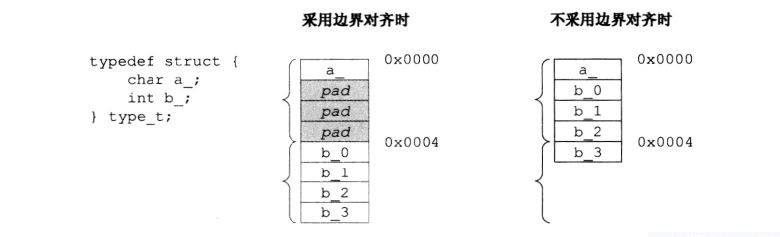

---
tags:
  - 计算机组成原理
---
# 计算机系统层次结构
## 1.计算机系统的基本组成
冯诺依曼--指令和数据混合存储
哈佛（现代）--指令和数据存储在不同存储器
## 2.计算机硬件的基本结构
### 主存储器 
### 运算器
1. ACC累加器
2. MQ乘商寄存器
3. X通用操作时寄存器、可以有多个
4. ALU算数逻辑单元，实现具体算数运算，逻辑运算
### 控制器
1. CU控制单元
2. IR指令寄存器、存储当前指令
3. PC程序计数器、存放下一条指令地址
## 3.计算机软件和硬件的关系
硬件+软件=计算机
## 4.计算机系统的工作原理
输入-处理-存储-输出
## “存储程序”工作方式，高级语言程序与机器语言程序之间的转换，程序和指令的执行过程
1. **源代码** (`.c`) → **预处理** → **预处理文件** (`.i`)
2. **预处理文件** (`.i`) → **编译** → **汇编文件** (`.s`)
3. **汇编文件** (`.s`) → **汇编** → **目标文件** (`.o`)
4. **目标文件** (`.o`) → **链接** → **可执行文件** (`.exe`)
- ciso
# 计算机性能指标
- **吞吐量**：CPU用于运行用户代码的时间与CPU总消耗时间的比值
- **响应时间**：指从用户发出请求到计算机系统做出响应的时间。
- **时钟周期 (Clock Cycle)**：计算机的时钟周期是指系统时钟的一个完整周期。
- **主频 (Clock Frequency)**：是指 CPU 每秒钟所执行的时钟周期数，单位为赫兹 (Hz)。
- **CPI (Cycles Per Instruction)**：每条指令所需的时钟周期数。
- **CPU 执行时间**：指 CPU 执行某个程序所需的总时间，可以用以下公式计算：  
    $$
    \text{CPU 执行时间} = \text{指令数} \times \text{CPI} \times \text{时钟周期时间}$$
- **MIPS**:每秒执行多少条指令
- **MTTF**:平均无故障时间
- MFLOPS、GFLOPS、TFLOPS、PFLOPS、EFLOPS 和 ZFLOPS 作为浮点运算性能的度量单位,MGTPEZ,MG/TP/EZ---
tags:
  - 计算机组成原理
---
# 进制转化
## 10进制=> 2进制
整数部分：除基取余法
- 短除法，倒过来看
小数部分：乘基取整法
- 取整数部分，0.6取0，1.2取1然后-1得到0.2
# 定点数的表示
## 定点数
小数点位置固定的数
## 原码
## 补码
### 补码快速计算真值
- 符号位负数，其他位正数
- 如补码1101=-8+4+1=-3
### 由x补求-x补
符号位、数值位全部取反、末位加1
### 补码移位
逻辑移位
- 直接左移
算术移位
- 补码左移低位补0，右移高位补符号位
- 左移符号位改变则溢出
## 反码
## 移码
原码+偏置
# 运算方法和运算电路
## 1.基本运算部件
加法器，算术逻辑部件(ALU)
## 2.加/减运算
### **补码加/减运算器**
### 补码全加器的实现
#### 异或的实现
$S = (A \land \neg B) \lor (\neg A \land B)$
#### 概念
A被加数的一位
B加数的一位
C_in前一位的进位
C_out正在计算的这一位的进位
S这一位的结果
#### 计算过程
$S = A \oplus B \oplus C_{\text{in}}$
$C_{\text{out}} = (A \land B) \lor (C_{\text{in}} \land (A \oplus B))$
- $(A \land B)$ 1+1是进位必为1
- $(C_{\text{in}} \land (A \oplus B))$ 0+1/1+0时，C_in为1则进一	
### **标志位的生成**
用一个电路就能实现加减法(A直接进加法器，B通过MUX选择后进加法器)
- 通过mux实现两条路（一条直接加，另一条取反+1之后加）
- sub信号是1表示是减法
#### 零标志、ZF
#### 溢出标志、OF
对有符号数才有用
单符号位
- 符号位进位和最高数位进位异或$C_{\text{n.out}} \oplus C_{\text{(n-1).out}}$
- 补码减法时，最低位会有一个sub信号表示上一位进位是1
双符号位
- 两个符号位异或
#### 符号标志、SF
单符号位直接=符号位，双符号位取实际符号位
#### 进位标志、CF
无符号数才有用
$(C_{\text{in}}或sub) \oplus C_{\text{out}}$
1. sub和cin是一样的
2. 减法时cin恒等于1
	- 因为 已知x补 求 -x补 需要全部取反+1，MUX只负责取反，+1由cin完成
	- 例10111（-9补码）-11000（-8补码）=-1，直接10111+00111，最低位进位需要设为1得11111（-1补码）
加法时，CF = 1表示无符号数加法溢出
减法时，CF = 1表示有借位，即不够减
## 3.乘/除运算
乘/除法运算的基本原理，乘法电路和除法电路的基本结构
### 乘法
#### 原码一位乘法
先异或确认符号位，然后加法一次右移一次，乘法转为多次加法
#### 补码一位乘法
每次加法可能 +0 、+（x补）、+（-x补），加完之后符号位自动确认
n轮加法、算数右移，加法规则如下:
- 01辅助位-MQ中最低位=1时，(ACC)+（x补）
- 11/00辅助位-MQ中最低位=0时，(ACC)+0
- 10辅助位-MQ中最低位=-1时，(ACC)+（-x补）
- 其中辅助位时后一位，MQ中最低位是前一位，被乘数最后开始取到前面，两位两位的取
# 整数的表示和运算
## 1.无符号整数的表示和运算
## 2.带符号整数的表示和运算
# 浮点数的表示和运算
## 1.浮点数的表示
### IEEE 754 标准
#### 特殊00/01/10/11
阶码全0，尾数全0即为0【正负之分看最高符号位】
阶码全0，尾数不全为0，取消隐含1规则，实际数为0.M * 2^**-126** 
阶码全1，尾数全0，代表无穷【正负之分看符号】
阶码全1，尾数不为0，无效数
#### 舍入
- 截断法
- 恒置1法
- 0舍1入法（可能导致尾数溢出，需要右规）
## 2.浮点数的加/减运算
- 对阶-小对大
- 尾数加减
- 规格化
	- 左规：当浮点数运算的结果为非规格化时要进行规格化处理，将尾数算术左移， 阶码减1。
	- 右规：当浮点数运算的结果尾数出现溢出（双符号位为01或10）时，将尾数算术右移一位，阶码加1。
- 舍入
    - 截断法
    - 恒置1法
    - 0舍1入法
        - 可能导致尾数溢出，需要右规   
- 判溢出
# 补充
## 强制类型转换
- float转int
	- 去尾  如：（int）9.99=9    
- int转float
	- 可能会有精度丢失
	- 虽然int和float都是32位，但是int32都可以表示数据，float只有23位表示数据，32位精度转23位精度会丢失      
- short转int
	- 无符号补零
	- 有符号补码存储补1
---
tags:
  - 计算机组成原理
---
# 概念
## 存储周期/读写周期
- 连续两次存取操作所需要的最小时间间隔
- 存取时间+恢复时间=存储周期
# 存储器的分类
## 按照存储介质分类
### 半导体存储器
主存、cache（断电数据会丢失）
### 磁性材料存储器
磁盘、磁带、软盘
### 光介质存储器
光盘
## 存取方式分类
### 随机存取存储器 RAM、Random Access Memory
读写任何一个存储单元所需的时间都相同，与存储单元所在物理位置无关
内存条、U盘等
### 顺序存取存储器 SAM、Sequential Access Memory
读写一个存储单元所需时间取决于存储单元所在的物理位置（磁带）
### 直接存取存储器 DAM、Direct Access Memory
既有随机存取特性，也有顺序存取特性。先直接选取信息所在区域，然后按顺序方式存取。(机械磁盘)
### 相联存储器 Associative Memory
可以按照内容检索到存储位置进行读写。
快表：内存逻辑地址转物理地址的工具
## 信息的可更改性
### 读写存储器 Read/Write Memory
可读、可写。有磁盘、内存、Cache
### 只读存储器 Read Only Memory
只读、不可写。(不是完全不能写，写比较读更费劲)
音乐专辑CD-ROM
# 层次化存储器的基本结构
速度从高到低
- 寄存器
- 高速缓存（Cache）
- 主存储器（主存、内存）
- 辅助存储器（外存）
# 半导体随机存取存储器
## 存储器组成
*存储矩阵*是由一个一个的存储元构成；
*译码驱动电路*分为*译码器*和*驱动器*，译码器会输出某一条线路的高电平信号，驱动器是为了保证译码器输出的高电平稳定可靠的，可以理解为将电信号放大的部件。
*读写电路*是连通存储元的电路
*地址线*：用来读取和写入数据，接收地址信息，通常是CPU通过地址总线传来的,决定寻址范围
*数据线*：实现数据的传输，其位数与芯片可读出或写入的数据位数有关
*片选线*：传输芯片选择信号或者芯片使能信号，用来选择存储芯片
*读写控制线*：可以一条，可以两条
## 1. SRAM存储器（cache）

## 2. DRAM存储器（主存）
破坏性读出，需要刷新
### DRAM的地址复用技术
- 先传送行地址，后传送列地址、分两次传送
- 可以减少地址线、地址引脚减半
- 比如4M\*8位芯片，本来需要22根地址线，复用后只需要11根
## 3. Flash 存储器
- 一种非易失性存储器，断电后数据也不会丢失。
- 允许多次擦写操作，广泛用于固态硬盘、USB闪存驱动器、存储卡等。
- 与传统的ROM相比，Flash存储器的一个主要优势是它可以进行擦除和重新编程。
- 需要有至少一个**物理块（Block）** 作为交换块使用，因为写操作必须是先擦除，然后才能写入数据，而擦除的最小单位是一个物理块，交换块用来临时存储不需要被擦除的数据
# 主存储器
## 1.DRAM 芯片和内存条
### 双端口RAM
优化多核CPU访问一根内存条的速度
只能同时读，两个端口同时写，一个读一个写都不行
## 2.多模块存储器
### 多模块存储器
#### 单体多字存储器
- 每个存储单元存储m个字
- 总线宽度m个字
- 一次并行读出m个字    
#### 多体并行存储器（双通道内存）
- 高位交叉编制
- 低位交叉编制
- 每个存储周期读出m个字
## 3.主存和 CPU 之间的连接
### 位扩展法
CPU数据项线和存储信息数据位数不一致(一般是CPU的数据线大/多)
### 字扩展法
#### 线选法
没有使用译码器，浪费了控制/地址线
4个对应0001/0010/0100/1000
#### 片选法
使用译码器，两位对应四种（00/01/10/11）
### 理解(例 8K\*1位)
位扩展8K\*8位,增加数据线
字扩展16K\*1位,增加地址线
# 外部存储器
## 1.磁盘存储器
### 组成
驱动器（机械结构）
控制器（电路）
### 磁盘地址结构
柱面号->盘面号->扇区号
### 存取时间
寻道时间+旋转延迟+传输时间
### 磁盘阵列
RAID0 无冗余校验，类比低位交叉编址
RAID1 镜像一份
RAID2 4bit信息+3bit海明校验
RAID3 位交叉奇偶校验
RAID4 块交叉奇偶校验
RAID5 无独立校验的奇偶校验
## 2.固态硬盘(SSD)
### 组成
主控--闪存--固件算法
### 主控
使用映射表访问flash颗粒，类似页表访问页
### 固件算法
耗损平衡，错误校正码(ECC)，坏块管理、垃圾回收算法等
因为删除时是逻辑删除（将映射表映射删除），所以SSD快满时，需要将多个半满的块整合成一个块才能空出块给用户写入数据，这时候写速度会变慢
# 高速缓冲存储器(Cache)
## 1.Cache 的基本原理
物理地址分为标记，行号，块内偏移
1. 先通过行号找到对应cache行
2. 然后通过比较器比较标记tag是否相同，不相同导致cache缺失
3. 如果相同直接从cache行中的数据块中读出内容，缺失需要读主存，将主存块放入cache后再次访问cache
## 2.Cache 和主存之间的映射方式
### 全相联映射
主存块可以放在Cache的任意位置
主存地址表示：标记+块内地址
标记就是在主存中标记出一块，比如主存4096块，就需要12位标记出特定的一块
### 直接映射
只能放到一个特定的位置
Cache 号：主存块号%Cache总块数
主存地址表示：（标记+Cache 号）+块内地址
### 组相联映射
Cache块分为若干组，组号=主存块号 ％分组数
主存地址表示：标记+组号+（组内槽号）+块内地址
n路组相联就是n个块为一组，分成（cache总块数/n）个组
## 3.Cache 中主存块的替换算法
### 随机算法（RAND）
### 先进先出（FIFO）
- 实现：按照行号轮流替换
### 近期最少使用（LRU）
- 手算：往前看，哪个最后出现替换哪个
- 实现：给cache块添加计数器，替换计数器最大的 *需要一个替换控制位*
	- 命中时，所命中的行的计数器清零，比其低（只需找最大，这样可减少操作）的计数器加1，其余不变; 
	- 未命中且还有空闲行时，新装入的行的计数器置0，其余非空闲行全加1; 
	- 未命中且无空闲行时，计数值最大的行的信息块被淘汰，新装行的块的计数器置0，其余全加1
### 最不经常使用算法 (LFU)
- 每被访问一次计数器+1。需要替换时，选择计数器最小的一行
- 缺点：曾经被经常访问的主存块在未来不一定会用到，但计数器已经很大了，未来可能很久不会淘汰
## 4.Cache 写策略
Cache 仅存储主存中的数据副本，此副本更改后如何写回主存，多级cache可以使用不同的策略
### 写命中（写的块在cache里）
#### 写回法
只修改Cache的内容，而不立即写入主存，只有当此块被换出时才写回主存
添加脏位，标记是否修改过
#### 全写法
当CPU对Cache写命中时，必须把数据同时写入Cache和主存
Cache和主存之间添加FIFO写缓冲
写操作频繁，可能会发生写缓冲饱和而阻塞
### 写不命中（写的块不在cache里）
#### 写分配法
主存中的块调入Cache，在Cache中修改。通常搭配写回法使用。
#### 非写分配法
主存中的块不调入Cache，直接在主存中修改。通常搭配全写法使用。
# 虚拟存储器
## 1.虚拟存储器的基本概念
程序不用全部放入内存，只需将用到的放到驻留集中
## 2.页式虚拟存储器
基本原理，页表，地址转换，TLB(快表)。
## 3.段式虚拟存储器的基本原理
## 4.段页式虚拟存储器的基本原理---
tags:
  - 计算机组成原理
---
# 指令系统的基本概念
指令集体系结构（ISA）
- 规定计算机指令格式/操作数格式/寄存器权限/控制方式（PC）
# 指令格式
- 操作码+地址码
- 定长/变长，零/一/二地址指令
# 寻址方式
## 指令寻址
PC给出下一条指令的地址
## 数据寻址
### 直接寻址
指令字中的形式地址就是操作数的真实地址EA
### 间接寻址
#### 一次间址
形式地址中存储 真实地址所在的存储单元的地址，也就是操作数地址的地址。
#### 两次简址
### 寄存器寻址
形式地址 中给出操作数所在的寄存器编号。
#### 寄存器间接寻址
寄存器中给出操作数所在的主存单元的地址。EA=(Ri)
### 隐含寻址
指令中隐含这操作数的地址
举例：加法运算，形式地址中有一个操作数的地址。另一个操作数在 ACC寄存器中。
### 立即寻址
形式地址中存储操作数本身，又称立即数。一般采用补码表示。
### 基址寻址
将CPU中基址寄存器/BR 的内容加上指令格式中的形式地址A
基址寄存器是面向操作系统的，内容有操作系统或管理程序确定。
形式地址可正可负，使用补码存储，相加时需要转换成真值进行加减
### 变址寻址
形式地址A与变址寄存器IX的内容相加之和
变址寄存面向用户，用户可以改变
适合处理循环
### 基址寻址与变址寻址的区别
基址寻址实现程序的动态再定位
- 比如基址是0，我执行完一个在100的程序要切换到地址在200的程序，只需要跳转基址+200的地方就行
变址寻址实现程序内的地址变化
- 我在地址为100的程序中for循环访问数组，大小是5；
- 使用基址需要5条指令，形式地址分别是100.101.102.103.104；
- 但使用变址只需要执行同一条指令5次，每次执行完就将变址寄存器里的值+1；
	- 一开始变址100，形式地址0；
	- 最后变址104，形式地址0，形式地址一直不变。
### 相对寻址
程序计数器PC的内容（当前执行指令的地址+1）加上 形式地址A 而形成操作数的有效地址。即EA=(PC)+A。
A是相对于PC所指地址的位移量，可正科负，补码表示。
jmp等跳转指令的实现
### 堆栈寻址
操作数存放在堆栈中，隐含使用堆栈指针(SP)作为操作数地址
# 数据的对齐和大/小端存放方式
## 数据的对齐
一般一次读内存读的是一个机器字长，64位计算机一次读取64bit
数据对齐可以防止读取数据的时候，一个数据被分割在两个字（32b）中，导致需要拼接才能读取到数据，多访存一次


### 具体存放规则
n字节的数据就需要在n的整数倍的字节开始存放
## 数据的高位是较大的部分
最高有效字节MSB
最低有效字节LSB
## 区分大小端
### 大端（从大到小，符合直觉）
MSB->LSB
### 小端（从小到大，反直觉）
LSB->MSB
# CISC 和 RISC的基本概念
## CISC复杂指令集
- 代表：X86架构(PC)
- 一条指令完成一个复杂的基本功能
## RISC精简指令集
- 代表：ARM架构(手机)
- 一条指令完成一个基本动作，多条指令组合完成一个复杂的基本功能。
- 只有load/store指令可以访存
# 高级语言程序与机器级代码之间的对应
## 1. 编译器、汇编器和链接器的基本概念
编译器：代码->汇编
汇编器：汇编->多个可重定位文件.o
链接器：多个可重定位文件.o->.exe
## 2. 选择结构语句的机器级表示
```x86asm
CMP x, 10     ; 比较x和10
JG  label_A   ; 如果x > 10，跳转到label_A
; 执行B(else语句块)
JMP  label_end ; 跳转到结束
label_A:
; 执行A（if符合的语句块）
label_end:
```
## 3. 循环结构语句的机器级表示
```x86asm
MOV i, 0          ; i = 0
loop_start:
CMP i, 10         ; 比较i与10
JGE loop_end      ; 如果i >= 10，跳出循环
; 执行循环体
INC i             ; i++
JMP loop_start    ; 跳回开始，继续下一次循环
loop_end:
```
## 4. 过程(函数)调用对应的机器级表示
```C
int add(int a, int b) {
    return a + b;
}
int caller() {
    int var1 = 125;
    int var2 = 80;
    int result;
    result = add(var1, var2);
    return result;
}
```
```asm
caller:
    push ebp                 ; push指令先让esp+4，然后把调用者的ebp保存到esp中
    mov ebp, esp             ; 将调用者栈顶作为自己的栈底
    sub esp, 24              ; 栈是向低地址增长，-24就是分配6个栈空间给caller函数（以4字节为单位）
    mov [ebp-12], 125        ; 将125存储到[ebp-12] (var1)
    mov [ebp-8], 80          ; 将80存储到[ebp-8] (var2)
    mov eax, [ebp-8]         ; 将var2 (80)加载到eax
    mov [esp+4], eax         ; 将eax的值（80）存储到栈的[esp+4]（add函数参数a）
    mov eax, [ebp-12]        ; 将var1 (125)加载到eax
    mov esp, eax             ; 设置esp为var1的值（120）
    call add                 ; 调用add函数，栈上参数为80和125
（call指令会将调用者的PC值压栈，并将被调用者地址存入PC）
    mov [ebp-4], eax         ; 将add函数的返回值存储到[ebp-4] (result)
    mov esp, ebp             ; 栈顶指针指向栈底
    pop ebp                  ; pop指令先让esp-4，然后把栈中存储的调用者的ebp赋给ebp
    ret                      ; 返回
（ret指令会读取栈顶esp写回PC寄存器）
add:
    push ebp                 ; push指令先让esp+4，然后把调用者的ebp保存到esp中
    mov ebp, esp             ; 将调用者栈顶作为自己的栈底
    mov eax, [ebp+12]        ; 获取第一个参数a
    mov edx, [ebp+8]         ; 获取第二个参数b
    add eax, edx             ; 将eax和edx相加，结果存储在eax
    mov esp, ebp             ; 栈顶指针指向栈底
    pop ebp                  ; pop指令先让esp-4，然后把栈中存储的调用者的ebp赋给ebp
    ret                      ; 返回
```

| ![[../../pic/Pasted image 20241208161649.png|200]] | ![[../../pic/Pasted image 20241208162936.png|180]] |
| ----------------------------------------------- | ----------------------------------------------- |
sum就是调用者ebp-4，temp2是ebp-8，x是被调用者的ebp+8
mov指令不支持两个操作数都来自内存，所以需要eax中转
### 寄存器
EBP指向栈底
ESP指向栈顶---
tags:
  - 计算机组成原理
aliases: []
---
# CPU的功能和基本结构
ALU+寄存器+PSW [数据的表示和运算 \> \*\*标志位的生成\*\*](../计算机组成原理/数据的表示和运算.md#**标志位的生成**)+移位器+计数器
# 指令执行过程
## 指令周期
取指+执行一条指令所用的时间
包含多个机器周期
## 指令流程
### 取指周期   
将PC中的值送到MAR作为访存地址，访存得到的指令内容存在MDR，然后将MDR的内容送到指令寄存器IR，PC自增（+1）
这里送的动作通过CPU总线实现
### 间指周期（可选）
第一次访存得到指令的地址，第二次访存才得到指令，则第一次是间址周期
### 执行周期   
根据操作码执行
### 中断周期（可选）
# 数据通路的功能和基本结构
## 定义
- 数据在功能部件之间传送的路径
## 组成
### 组合逻辑元件（操作元件）
- 输入决定输出
- 不含存储信号的记忆单元
- 如译码器，多路选择器，三态门
### 时序逻辑元件（状态元件）
- 与此刻的输入和此前的输入都有关
- 必须有存储信号的记忆单元
- 如通用寄存器组，PC，锁存器
### 寄存器与ALU之间的数据传送(执行算数或逻辑运算)
一个暂存寄存器直连ALU，一个ACC累加器寄存器通过总线连接ALU，两个同时通向ALU实现加法
# 控制器的功能和工作原理
## 工作原理
- CU 发出一个 微命令，可完成对应 微操作。
## 设计
### 硬布线
- 根据指令操作码、目前的机器周期、节拍信号、机器状态条件、即可确定当前状态应该发出哪些 “微命令”
- 比如遇到执行周期的ADD和LDA(读取数据到ACC)就执行M(MAR)->MDR
### 微程序
#### 概念
- 程序：指令序列
- 微程序：微指令的有序集合
	- 采用“存储程序”的思想，CPU出厂前所有指令的“微程序”存入“控制器存储器”中
	- 存放微程序的地址是微地址        
- 微指令：包含微操作码 和 微地址码
- 微周期：从控制器存储器取出一条微指令并执行相应微操作所需的时间
- 微命令：收到微命令执行微操作，微命令与微操作一一对应
#### 执行过程
1. 将指令的操作码送到微地址形成部件
2. 得到初始微地址和微程序长度，初始微地址存入μPC（CMAR）
3. 通过地址译码，去控制器存储器CM找到微指令，然后存入，μIR（CMDR）
4. 通过微指令的下地址（类似指令地址码）找到下条微指令地址
#### 微指令的格式
##### 水平型微指令
- 一条微指令可以定义多个 可并行的微命令（微操作）
##### 垂直型微指令
- 一条指令只能定义一个微命令（微操作）
#### 微指令的编码方式（重要）
##### - 直接编码、直接控制
- 微指令的操作控制字段中，每一位代表一个微操作命令
- 1001 1001八位对应执行1，4，5，8位对应的操作，8位只能对应8种操作
##### - 字段直接编码方式
- 将微指令的控制字段分成若干 ‘段“，每段经译码后发出控制信号。
- 译码使得4位对应15种操作（减去一种空操作）
###### 分段原则
- *互斥性微命令在同一段内 相容性微命令在不同段内*
- 每个小段信息为不能太多
- *每个小段留出一个状态(一般是全0)，表示本字段不发出任何微操作*
##### - 字段间接编码方式、间接编码、隐式编码
- 一个字段的某些微命令需由另一个字段中的某些微命令来解释
#### 微指令的地址形成方式
- 微指令的 下地址字段 指出。（分支转移）
- 增量计数器法 (μPC)+1->μPC
- 第一条微指令地址，由微地址形成部件（硬件）产生
- 中断周期，由 硬件 产生中断周期微程序首地址
# 异常和中断机制
## 1.异常和中断的基本概念
### 中断向量
中断服务程序的入口地址。
### 中断向量表
把系统中所有的中断类型码及其对应的中断向量按一定的规律存放在一个区域内，这个存储区域就叫做中断向量表。
### 中断源
1. 软中断/内中断。 
2. 外中断/硬件中断 
3. 异常
### 中断屏蔽字
- 1代表屏蔽，0代表响应
- 如四个中断中，一号中断屏蔽字1101代表不屏蔽第三个中断，即第三个中断优先级大于第一个中断
### 硬中断和软中断
- 硬中断是硬件引起的，如键盘
	- **终止异常**和**外中断**
- 软中断是软件引起的，如缺页
	- **故障异常**和**自陷异常**
## 2.异常和中断的分类
### 异常
#### 故障
缺页，除零
#### 自陷
- 预先安排的异常（例如断点）
- 返回之后从下条指令开始
#### 终止
使计算机无法继续执行的硬件故障，如控制器出错、存储器校验错等
### 中断
- 可屏蔽中断
- 不可屏蔽中断
## 3.异常和中断的检测与响应
1. **软件识别方式**：
    - CPU设置异常状态寄存器记录异常原因。
    - 操作系统通过统一查询程序按优先级顺序查询异常状态寄存器，检测异常和中断类型，先查询到的先处理，随后跳转至内核处理程序。
2. **硬件识别（向量中断）**：
    - 异常或中断处理程序的首地址称为中断向量，存储在中断向量表中。
    - 每个中断或异常都分配一个中断类型号，类型号对应中断向量表中的条目，类似数组下标。
# 指令流水线
## 1.指令流水线的基本概念
- 流水线的性能指标
    - 吞吐率、TP
        - 单位时间内流水线所完成的任务数量
    - 加速比、S
        - 完成同样一批任务，不使用流水线所用的时间 与 使用流水线所用的时间 之比。
    - 效率、E
        - 设备的利用率
            - 红框除以蓝框
## 2.指令流水线的基本实现
### 五个阶段（MIPS架构）
- IF Fetch取指    
- ID Decode译码、取数（读寄存器，会被数据冒险阻塞）
- EX EXecute执行
- M Memory访存（条件转移指令这里写PC寄存器 ）
- WB Writeback写回寄存器
### 锁存器
- 流水线的每一个功能段部件后面都要有一个缓存寄存器/锁存器。
- 保存本流水段的执行结果，提供给下一流水段使用
## 3.结构冒险、数据冒险和控制冒险的处理
### **结构冒险（Structural Hazard）**  
指两条指令在不同阶段争用相同硬件资源（如内存）。解决方法包括：
- 后一条指令暂停一周期
- 数据重复配置，使用分离型cache，一个数据cache一个指令cache
- 多端口寄存器，寄存器读写口分开，可同时读
- 功能划分原则：每个部件每条指令只能在特定时钟周期使用一次
### **数据冒险（Data Hazard）**  
指后一条指令依赖前一条指令的结果，但前一条指令结果尚未产生。解决方法包括：
- 暂停若干时钟周期（硬件阻塞或软件插入NOP）
- 在load-use问题中，不能使用转发技术，只能插入流水线气泡
- 使用寄存器直通（转发机制）将最新计算结果直接传给下一条指令的ALU输入端
- 编译优化：通过调整指令顺序解决数据相关问题
### **控制冒险（Control Hazard）**  
发生在分支指令中，解决方法包括：
- 转移指令分支预测：简单预测（永远猜条件满足或不满足）、动态预测（根据历史推测）
- 预先把分支指令的两种可能都取出来
- 提前形成条件码（if判断的true/false），提高预测准确性
- 分支预测失败时，需要恢复寄存器状态到分支指令执行时
## 4.超标量和动态流水线的基本概念
### 超标量技术
- 每个时钟周期内可 并发多条独立指令
### 动态流水线
由**硬件**自动对指令的执行次序进行调度，==前面指令的阻塞不影响后面指令的继续前进。==
- 动态指令调度：指令在执行时根据实际情况调整执行顺序。
- 支持乱序执行：处理器可以不按程序顺序执行指令。
- 可以进行动态分支预测和指令重排，以减少冒险和延迟。
# 多处理器基本概念
## 1.SISD、SIMD、MIMD、向量处理器的基本概念
**SISD (单指令流单数据流)**
- 只能并发执行指令，不能并行。
- 每条指令处理一个数据。
- 硬件：一个处理器 + 一个主存储器。
- 可通过指令流水线增加功能部件和多模块交叉存储器。
**SIMD (单指令流多数据流)**
- 各指令并发执行，每条指令处理多个数据。
- 数据级并行技术。
- 硬件：一个CU + 多个执行单元 (如ALU) + 多个局部存储器 + 一个主存储器。
- 例如，优化for循环。
**MISD (多指令流单数据流)**
- 多个CPU执行多条指令并行处理同一数据。
- 现实中不存在这种计算机。（读写冲突）
**MIMD (多指令流多数据流)**
- 各指令并行执行，处理不同数据。
- 线程级或更高级的并行技术。
- 分成多处理器系统和多计算机系统
## 2.硬件多线程的基本概念
在处理器中同时管理多个线程状态，当线程发生切换时，处理器瞬间切换到对应的线程状态执行
### **分类**
1. 粗粒度
- 处理器在发现一个线程被长时间中断（如Cache miss）时，切换到其他线程执行。
1. 细粒度
- *每个时钟周期*都切换一次线程
2. 同时多线程（SMT）（指令级并行，上面两个只有线程级并行）
- 在超标量处理器中，同时发射多个线程的指令，多个线程的指令并行执行。
## 3.多核(multi-core)处理器的基本概念
一条总线上挂载多个处理器
共享cache和存储和总线，需要使用锁来限制读写
- **UMA**：所有处理器共享统一的内存访问，访问速度均等，适用于小规模系统。
- **NUMA**：每个处理器有自己的本地内存，访问自己内存快速，访问其他处理器内存有延迟，适用于大规模系统。
## 4.共享内存多处理器(SMP)的基本概念
1. **多处理器协同工作**
2. **共享资源**：处理器共享同一个内存、I/O接口和外部中断
3. **对称性**：所有处理器对内存和系统资源的访问权限是平等的
4. **并行计算能力**：由于多个处理器可以同时执行多个任务，适合多任务和并行计算需求。
5. SMP属于UMA---
tags:
  - 计算机组成原理
---
# 总线
## 1.总线的基本概念
- 能为多个部件分时共享的公共信息传送线路
- 分为共享总线和分时总线
## 2.总线的组成及性能指标
### 总线的组成及性能指标总结
#### **总线的组成：**
**片内总线**：
- 用于芯片内部不同部件之间的连接，如CPU内部寄存器、ALU之间的连接。
**系统总线**：
- 连接计算机系统各部件（如CPU、主存、I/O接口）之间。
- 包括：
	- **数据总线**：传输数据。
	- **地址总线**：传输地址信息。
	- **控制总线**：传输控制信号。
**总线结构**：
- **单总线结构**：所有设备连接到同一总线。
- **双总线结构**：通过通道管理慢速I/O设备，一条总线连cpu主存通道，通道和外存一条总线
- **三总线结构**：CPU通过IO总线连接io接口，通过主存总线连接主存，通过DMA总线连接主存和IO接口
- **四总线结构**：通过桥接器连接不同总线，具有缓冲、转换和控制功能。
#### **总线的性能指标：**
1. **总线的传输周期**：
	- 一次总线操作所需的时间，包括申请、寻址、传输和结束阶段。
2. **总线时钟周期**：
	- 机器的时钟周期，控制整个计算机及总线操作。
3. **总线的工作频率**：
	- 总线操作的频率，通常是总线周期的倒数。
4. **总线的时钟频率**：
	- 机器时钟频率，表示每秒钟有多少个时钟周期。
5. **总线宽度**：
	- 总线一次能传输的数据位数，通常表示为位数（如32位总线）。
6. **总线带宽**：
	- 单位时间内总线能传输的数据量。计算公式为：
	- 总线带宽 = 总线工作频率 × 总线宽度（bit/s）
	- 或者 总线带宽 = 总线工作频率 ×（总线宽度/8）(B/s)
## 3.总线事务和定时
1. **总线事务的四个阶段**：
    - **申请分配阶段**：设备发出请求，仲裁决定哪个设备使用总线。
    - **寻址阶段**：主设备通过总线发送从设备地址和命令，启动从设备。
    - **传输阶段**：主从设备进行数据交换。
    - **结束阶段**：释放总线使用权。
2. **总线定时**：
    - 设备间为了协调数据交换的时间制定的协议。
	- 分类：
		- **同步通信**：统一时钟协调，适用于总线短且设备存取时间接近的系统，但可靠性差。
		- **异步通信**：无统一时钟，通过“握手”信号进行控制，分为：
			- **不互锁**：发送后不必等应答。
			- **半互锁**：发送信号等待应答后撤销。
			- **全互锁**：发送信号等应答才能撤销。
		- **半同步通信**：结合同步和异步，使用统一时钟并增加“等待”信号。
		- **分离式通信**：不使用总线的那段时间，放弃占用总线 从设备准备好后，在申请占用总线，传输数据
# I/0接口(I/0控制器)
## 1.I/0 接口的功能和基本结构
### I/0 接口的功能
- 数据缓存
	- 通过数据缓冲寄存器DBR，达到主机和外设工作速度的匹配    
- 错误或状态检测
	- 通过状态寄存器反馈设备的各种错误、状态信息、供CPU查用    
- 控制和定时
	- 接收从控制总线发来的控制信号、时钟信号
- 数据格式转换
	- 外设与主机的数据格式不一致，比如串行转并行
- 与主机和设备通信
	- 主机和外设的时序控制
- 地址译码
	- 译码之后在多个外设中选择正确的外设
### 基本结构
数据寄存器，状态/控制寄存器，io控制逻辑

## 2.I/O 端口及其编址
1. **统一编制（存储器映射方式）**：
    - 主存和I/O控制器共享地址空间，使用同一套地址码。
    - 通过不同的地址码区分主存和I/O端口，访存类指令可以访问两者。
    - 常见于RISC（精简指令集机器）架构。
2. **独立编制（I/O映射方式）**：
    - 主存和I/O控制器使用独立的地址空间。
    - 通过不同的指令格式区分内存和I/O设备。
    - 只能通过专用I/O指令访问I/O端口。
# I/0方式
## 1.程序查询方式
cpu轮询检查
- 独立查询 - CPU一直查询接口
- 定时查询 - 周期性查询
## 2.程序中断方式
### 中断的基本概念
中断请求，中断判优，中断响应，中断服务和中断返回五阶段
### 中断响应过程
使用中断隐指令，由硬件实现的
（1）某一中断源向CPU发起*中断请求*
- 内部中断立刻响应，外部中断执行完再响应
（2）CPU响应中断后，将*状态标志寄存器*压入堆栈保护；
（3）再将其中的中断标志位清除从而*关闭中断*；
（4）CPU将当前CS（PC的基址寄存器）和PC（将要执行的下一条地址）压入堆栈*保存断点*；
（5）CPU确定提出请求的中断源，获得中断向量号，在对应的中断向量表获得中断入口地址, 装入CS和IP中；
### 中断处理过程
使用中断服务程序，由软件实现
（6）将断点处各寄存器的内容压入堆栈保护现场；
（7）此时程序跳转至中断服务子程序执行；
（8）中断处理完毕，将堆栈各寄存器内容弹栈，恢复断点处各寄存器的值；
（9）在中断服务子程序最后安排一条返回指令，执行该指令将堆栈中CS和IP的值弹出，恢复主程序断点处地址值，同时恢复标志寄存器的内容。程序转至被中断的程序继续执行。
### 多重中断和中断屏蔽的概念
1. **单重中断**：
    - 关中断一直到执行完中断服务程序
2. **多重中断（中断嵌套）**：
    - 执行中断服务程序前，先开中断，没有新中断再执行，允许中断嵌套。
中断屏蔽字[中央处理器 \> 中断屏蔽字](../计算机组成原理/中央处理器.md#中断屏蔽字)
## 3.DMA 方式
### DMA 控制器的组成

### DMA 传送过程
例：数据缓冲寄存器32位，磁盘块512B，DMA每次传输一个块
1. **DMA请求**：
- 外设通过发送DMA请求将数据传送到数据缓冲寄存器（32位），并将传输长度寄存器值-1 初始值为128（512B/32b）。
2. **DMA控制器操作**：
- DMA控制器收到32B数据后向CPU发出*总线请求*，获得总线权限后将数据从缓冲寄存器传送到内存。
3. **传输完成与中断**：
- 当传输一块数据完成，如果传输长度寄存器减至0时，DMA控制器发出DMA*中断请求*通知CPU DMA过程已经完成
4. **总线冲突解决**：
- 当CPU和DMA都需要访问主存时，DMA优先：
	- **停止CPU访问主存**。
	- **交替访存**：CPU与DMA交替使用总线。
	- **周期挪用与窃取**：DMA优先访问，可能在CPU存取周期结束后访问主存。