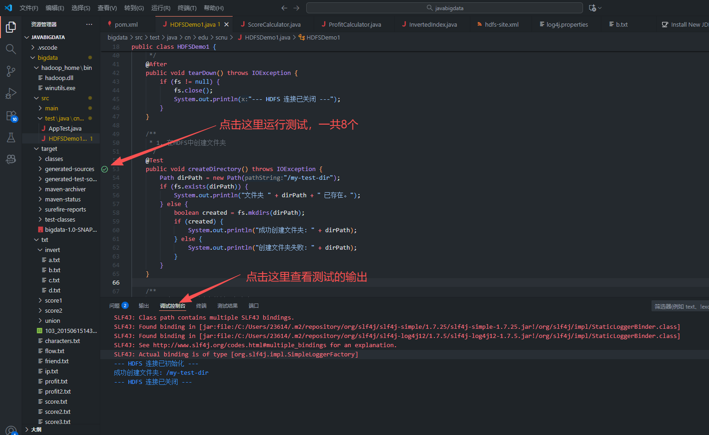

打开.vmx文件，开机选择“我已复制此虚拟机”
ip段：192.168.243.XXX
Vment8中关闭DHCP


配置免密登录： https://www.cnblogs.com/shireenlee4testing/p/10366061.html
```bash
# ssh-keygen -t rsa -P '' -f ~/.ssh/id_rsa这个命令会输出一堆东西，全部直接按回车
# Master01上执行
ssh-keygen -t rsa -P '' -f ~/.ssh/id_rsa
# Master02上执行
ssh-keygen -t rsa -P '' -f ~/.ssh/id_rsa
# Slave01上执行
ssh-keygen -t rsa -P '' -f ~/.ssh/id_rsa
# Slave02上执行
ssh-keygen -t rsa -P '' -f ~/.ssh/id_rsa
# Slave03上执行
ssh-keygen -t rsa -P '' -f ~/.ssh/id_rsa
# 回到Master01
cd .ssh
cp id_rsa.pub authorized_keys
scp authorized_keys  root@Master02:/root/.ssh/
# 登录Master02
cd .ssh
cat id_rsa.pub >> authorized_keys
scp authorized_keys  root@Slave01:/root/.ssh/
# 登录Slave01
cd .ssh
cat id_rsa.pub >> authorized_keys
scp authorized_keys  root@Slave02:/root/.ssh/
# 登录Slave02
cd .ssh
cat id_rsa.pub >> authorized_keys
scp authorized_keys  root@Slave03:/root/.ssh/
# 登录Slave03
cd .ssh
cat id_rsa.pub >> authorized_keys
# 复制回前面四个
scp authorized_keys root@Master01:/root/.ssh/
scp authorized_keys root@Master02:/root/.ssh/
scp authorized_keys root@Slave01:/root/.ssh/
scp authorized_keys root@Slave02:/root/.ssh/
```
五台机子关闭防火墙
- systemctl stop firewalld
- systemctl disable firewalld
```shell
# SELinux的防火墙可能还在运行，使用
getenforce #查看SELinux
setenforce 0 #关闭SELinux
```

### 启动方法
```bash
# 3个slave启动zookeeper
/home/hadoop/software/zookeeper-3.4.7/bin/zkServer.sh start
# Master01中启动hdfs
/home/hadoop/software/hadoop-2.7.1/sbin/start-dfs.sh
# Master01中启动yarn
/home/hadoop/software/hadoop-2.7.1/sbin/start-yarn.sh
# 访问webUI：http://192.168.243.128:50070/
```
### 关闭反过来
```shell
/home/hadoop/software/hadoop-2.7.1/sbin/stop-yarn.sh
/home/hadoop/software/hadoop-2.7.1/sbin/stop-dfs.sh
/home/hadoop/software/zookeeper-3.4.7/bin/zkServer.sh stop
```

使用以下命令查看Master01是否是Active
- hdfs haadmin -getServiceState nn1
如果是standby，用以下命令切换为Active
- hdfs haadmin -failover nn2 nn1

##### 如果访问webui发现datanode不足3个
```shell
# 三个slave上执行，会删除slave上的数据并重新生成storageID和datanodeUuid，谨慎运行，建议先在VMware进行快照再运行以下命令
rm -rf /home/hadoop/software/hadoop-2.7.1/tmp/dfs/data/*
# 运行完成后，hdfs可能进入安全模式，使用以下命令退出
hdfs dfsadmin -safemode leave
```
猜测出现的原因是
- 在未关闭HDFS的情况下，直接关闭虚拟机，导致datanode之间不同步
- 或是由于克隆导致的slave datanodeUuid相冲突

### VSCode(从github下载完整代码的可以跳到主题2和3)
**（老师的代码用的eclipse，如果会使用eclipse可以跳过此步，不用VSCode）**
==VSCode中安装扩展：==

- Chinese (Simplified) 
- Extension Pack for Java
- Maven for Java
##### 下载Java
cmd输入java -version有显示就跳过此步
https://www.oracle.com/java/technologies/downloads/#jdk25-windows

下载后打开msi文件安装

##### 下载Maven：(也可参考教程https://blog.csdn.net/szm1234/article/details/129559888)
- https://maven.apache.org/download.cgi
- 
- 添加环境变量，先添加MAVEN_HOME如D:\maven\，然后添加Path如%MAVEN_HOME%\bin
- 重新开一个cmd，输mvn -version验证

##### 打开文件夹后，创建Maven环境


- 然后选择maven-archetype-quickstart
- groupId用cn.edu.scnu
- artifactId随意，我这里使用bigdata

##### pom.xml
修改C:\Users\用户名\\.m2\settings.xml(或者在Maven安装目录\conf\\settings.xml),用下面的代码块完全替换现有的 mirrors 部分

```
<mirrors>
  <mirror>
    <id>central-http-unblocker</id>
    <mirrorOf>central</mirrorOf>
    <name>Aliyun Public Mirror for Central</name>
    <url>https://maven.aliyun.com/repository/central</url>
  </mirror>

  <mirror>
    <id>aliyunmaven</id>
    <mirrorOf>*</mirrorOf>
    <name>阿里云公共仓库</name>
    <url>https://maven.aliyun.com/repository/public</url>
  </mirror>
</mirrors>
```

在pom.xml同目录，打开终端运行
- mvn clean install -U
等待依赖安装结束

### 主题2和3
##### 运行bigdata\src\test\java\cn\edu\scnu下HDFSDemo1.java（AppTest.java同目录）中的八个测试
运行前请检查
- ip为192.168.243.128到192.168.243.132
- 已经按照[启动方法](#启动方法)启动hdfs
- 不一样的可以在HDFSDemo1类的开头改配置

第八个测试是主题3的内容

### 主题4
##### 上传文件
运行bigdata\src\test\java\cn\edu\scnu\UploadFile.java上传文件到hdfs
失败的话可能是权限问题，运行以下命令：
hdfs dfs -chmod -R 777 /input
##### 代码文件位置说明
```
##### 4.1
bigdata\src\main\java\cn\edu\scnu\ScoreCalculator.java
##### 4.2
bigdata\src\main\java\cn\edu\scnu\ProfitCalculator.java
##### 4.3
bigdata\src\main\java\cn\edu\scnu\InvertedIndex.java
```

##### 在\bigdata下运行 mvn clean package
得到jar文件\bigdata\target\bigdata-1.0-SNAPSHOT.jar
上传到master01，然后运行( 注意修改jar路径)
```bash
#4.1
# 确保 /output/score_out 目录不存在 
hdfs dfs -rm -r /output/score_out
hadoop jar /root/bigdata-1.0-SNAPSHOT.jar cn.edu.scnu.ScoreCalculator /input/score.txt /output/score_out
#4.2
# 确保 /output/profit_out 目录不存在 
hdfs dfs -rm -r /output/profit_out
hadoop jar /root/bigdata-1.0-SNAPSHOT.jar cn.edu.scnu.ProfitCalculator /input/profit.txt /output/profit_out
#4.3
# 确保 /output/invert_out 目录不存在 
hdfs dfs -rm -r /output/invert_out
hadoop jar /root/bigdata-1.0-SNAPSHOT.jar cn.edu.scnu.InvertedIndex /input/invert /output/invert_out
```
##### 查看结果
```bash
# 查看总分
hdfs dfs -cat /output/score_out/part-r-00000

# 查看利润 
hdfs dfs -ls /output/profit_out/
hdfs dfs -cat /output/profit_out/ls-r-00000
hdfs dfs -cat /output/profit_out/zs-r-00000
hdfs dfs -cat /output/profit_out/ww-r-00000

# 查看倒排索引
hdfs dfs -cat /output/invert_out/part-r-00000
```

### 主题5-Hive
mysql已经安装，启动命令：
- systemctl start mysqld
Hive已经安装，启动命令：
- /home/hadoop/software/hive-1.2.0/bin/hive
```bash
#上传words.txt
hdfs dfs -mkdir /words
hdfs dfs -put /root/words.txt /words/

#启动Hive
/home/hadoop/software/hive-1.2.0/bin/hive
#出现hive>  就是成功
hive> create external table words(word string) 

hive> row format delimited fields 

hive> terminated by ',' 

hive> location '/words';

hive> select * from words;

hive> select split(word,' ') from words;

hive> select explode(split(word,' ')) from words;

hive> select w,count(w) from (select explode(split(word,' ')) w from words) ws group by w;
```

### 主题六
##### 上传
bigdata\主题六\ 下的文件
上传nc-1.84-24.el6.x86_64.rpm
上传所有的配置文件
##### 三个Slave安装nc
```bash
rpm -ivh /root/nc-1.84-24.el6.x86_64.rpm
```
##### 多级流动
```bash
# slave03上运行
flume-ng agent --conf-file /root/tier-3-storage.conf --name a1 -Dflume.root.logger=INFO,console
# slave02上运行
flume-ng agent --conf-file /root/tier-2-relay.conf --name a1 -Dflume.root.logger=INFO,console
# slave01上运行
flume-ng agent --conf-file /root/tier-1-collect.conf --name a1 -Dflume.root.logger=INFO,console
# 测试
# slave01上打开新终端
nc 192.168.243.130 8090
# Slave01输入数据观察Slave03是否有输出
```
##### 扇入流动
```bash
# slave03上运行
flume-ng agent --conf-file /root/fan-in-aggregator.conf --name a1 -Dflume.root.logger=INFO,console
# slave02上运行
flume-ng agent --conf-file /root/fan-in-agent-B.conf --name a1 -Dflume.root.logger=INFO,console
# slave01上运行
flume-ng agent --conf-file /root/fan-in-agent-A.conf --name a1 -Dflume.root.logger=INFO,console
# 测试
# slave01上打开新终端
nc 192.168.243.130 8090
# slave02上打开新终端
nc 192.168.243.131 8090
# Slave01和Slave02输入数据观察Slave03是否有输出
```
##### 扇出流动
```bash
# slave03上运行
flume-ng agent --conf-file /root/fan-out-receiver-C.conf --name a1 -Dflume.root.logger=INFO,console
# slave02上运行
flume-ng agent --conf-file /root/fan-out-receiver-B.conf --name a1 -Dflume.root.logger=INFO,console
# slave01上运行
flume-ng agent --conf-file /root/fan-out-distributor.conf --name a1 -Dflume.root.logger=INFO,console
# 测试
# slave01上打开新终端
nc 192.168.243.130 8090
# Slave01输入数据观察Slave02和Slave03是否有输出
```

### 主题七
[启动方法](#启动方法)
```bash
#三个Slave启动zookeeper
/home/hadoop/software/zookeeper-3.4.7/bin/zkServer.sh start
#Master01启动hadoop和yarn
/home/hadoop/software/hadoop-2.7.1/sbin/start-dfs.sh
/home/hadoop/software/hadoop-2.7.1/sbin/start-yarn.sh
#Master01启动habse shell
/home/hadoop/software/hbase-1.3.1/bin/start-hbase.sh
# jps确认有HMaster再启动shell
/home/hadoop/software/hbase-1.3.1/bin/hbase shell
# 创建 User_info 表，包含 'base' 和 'info' 两个列族
create 'User_info', 'base', 'info'
# 插入数据
put 'User_info', 'John', 'base:birthday', '2001/10/1'
put 'User_info', 'John', 'base:gender', 'male'
put 'User_info', 'Tom', 'base:age', '19'
put 'User_info', 'Amy', 'base:birthday', '1999/1/1'
put 'User_info', 'Amy', 'base:gender', 'male'
put 'User_info', 'Amy', 'info:height', '178'
put 'User_info', 'Amy', 'info:weight', '130'
put 'User_info', 'Amy', 'info:hobby', '排球'
put 'User_info', 'Jason', 'base:age', '16'
put 'User_info', 'Jason', 'info:hobby', '篮球'
put 'User_info', 'Judy', 'base:birthday', '1998/11/2'
put 'User_info', 'Judy', 'base:gender', 'female'
put 'User_info', 'Judy', 'info:height', '165'
put 'User_info', 'Judy', 'info:weight', '102'
put 'User_info', 'Judy', 'info:hobby', '乒乓球'
put 'User_info', 'Alice', 'base:age', '19'
put 'User_info', 'Alice', 'base:gender', 'female'
# 全表扫描
scan 'User_info'
# 查找“John”的所有信息
get 'User_info', 'John'
# 查找“Jason”的年龄。
get 'User_info', 'Jason', 'base:age'
# 更新“Judy”的出生日期为“1999/10/20”
put 'User_info', 'Judy', 'base:birthday', '1999/10/20'
# 验证更新结果（可选）
get 'User_info', 'Judy', 'base:birthday'
# 删除“Alice”的全部信息
deleteall 'User_info', 'Alice'
# 验证删除结果（可选，应该查不到数据）
get 'User_info', 'Alice'

```

##### 代码位置信息
bigdata\src\main\java\cn\edu\scnu\HBaseTask.java

运行出错需要修改windows的hosts，打开C:\Windows\System32\drivers\etc\hosts，添加以下5行
```
192.168.243.128 Master01
192.168.243.129 Master02
192.168.243.130 Slave01
192.168.243.131 Slave02
192.168.243.132 Slave03
```

##### 关闭hbase命令
/home/hadoop/software/hbase-1.3.1/bin/stop-hbase.sh

##### 如果启动失败，可以使用以下命令重置hbase
```shell
# 谨慎运行，建议先进行快照再运行
# 删除 HDFS 上的hbase目录
hdfs dfs -rm -r /hbase
# 清理 ZooKeeper 中的元数据：
hbase zkcli
ls /
rmr /hbase
quit
```

### 主题八
从项目中上传bigdata\主题八\sqoop-1.4.4.bin__hadoop-2.0.4-alpha.tar.gz到Master01中
```shell
# 1. 解压到指定目录
tar -zxvf sqoop-1.4.4.bin__hadoop-2.0.4-alpha.tar.gz -C /home/hadoop/software/
# 2. 进入目标目录
cd /home/hadoop/software/
# 3. 重命名文件夹 
mv sqoop-1.4.4.bin__hadoop-2.0.4-alpha sqoop-1.4.4
# 4. 修改文件所属用户 
chown -R hadoop:hadoop /home/hadoop/software/sqoop-1.4.4

vi /etc/profile
# 添加环境变量
export SQOOP_HOME=/home/hadoop/software/sqoop-1.4.4
export PATH=$PATH:$SQOOP_HOME/bin

# 使配置生效
source /etc/profile

# 修改配置文件
cd $SQOOP_HOME/conf
cp sqoop-env-template.sh sqoop-env.sh
vi sqoop-env.sh

# 添加hadoop环境变量
export HADOOP_COMMON_HOME=/home/hadoop/software/hadoop-2.7.1 export HADOOP_MAPRED_HOME=/home/hadoop/software/hadoop-2.7.1


# 添加mysql支持
cp mysql-connector-java-5.1.38-bin.jar /home/hadoop/software/sqoop-1.4.4/lib/

# mysql中给hadoop用户授权
mysql -u root -p
# 输入密码: root

# 赋予任意 IP 访问权限
grant all privileges on *.* to hadoop@'%' identified by 'hadoop123' with grant option;

# 赋予 Master01 访问权限
grant all privileges on *.* to hadoop@'Master01' identified by 'hadoop123' with grant option;

# 刷新权限
flush privileges;

# 导入 easydb 数据库
create database if not exists easydb; 
use easydb;
source /root/easydb数据库.txt
show tables;

```

1.在Master01中安装 sqoop，测试安装成功 抓图  
```shell
sqoop version
```
2.将hdfs中txt文件夹下的score.txt导出到MySQL，写出导出步骤，并抓图
```mysql shell
# 在 mysql> 中执行
use easydb;
create table score ( name varchar(50), score1 int, score2 int, score3 int );
exit
```

```shell
hdfs dfs -put /root/txt/score.txt /input/

sqoop export \
--connect jdbc:mysql://Master01:3306/easydb \
--username hadoop \
--password hadoop123 \
--table score \
--export-dir /input/score.txt \
--input-fields-terminated-by ' '
```
3.将MySQL中的easydb数据库中的t_order表导入到hdfs中，写出导入步骤，并抓图

4.将word转换为pdf后提交