```mermaid
%%{
  init: {
    'theme': 'base',
    'themeVariables': {
      'primaryColor': '#E3F2FD',
      'primaryTextColor': '#111',
      'primaryBorderColor': '#42A5F5',
      'lineColor': '#666',
      'secondaryColor': '#FFF3E0',
      'tertiaryColor': '#FFF',
      'fontFamily': 'sans-serif'
    }
  }
}%%
graph LR
    subgraph " "
    direction LR
    style Start fill:#FFF,stroke:#FFF

        %% --- 1. 输入 ---
        User[👤 用户] --> Prompt["⌨️ Prompt '...727...'"]
        Prompt --> T2I1(✨ T2I 生成)
        T2I1 --> V1["🖼️ V1 (错误)"]
        V1 --> VLM_Diagnosis

    Start( ) -. "<b>[ 循环开始 ]</b>" .-> VLM_Diagnosis

    %% --- 2. 诊断循环 ---
    subgraph "VLM 诊断与修正循环"
        direction TB

        %% --- 2a. 诊断 ---
        VLM_Diagnosis{🤔 VLM 诊断}
        VLM_Diagnosis -- "P + V1" --> Check{{"<b>VLM 检查...</b>"}}
        Check -- " <b>'success'</b> " --> Success(✅ 成功!)
        Check -- " <b>'error'</b> " --> VLM_JSON["📄 JSON: 'wrong_concept'"]
        
        %% --- 2b. 调度 ---
        VLM_JSON --> Dispatcher[⚙️ 智能调度器]
        Dispatcher --> RAG_Flow
        Dispatcher --> ToolSelect
        
        %% --- 2c. RAG (带记忆) ---
        RAG_Flow("🔎 RAG 检索")
        RAG_Flow --> Stage1(📚 语义检索 Top-K)
        
        Memory["🧠💾 记忆 (排除列表)"] -. "过滤" .-> Filtered(🗑️ 过滤候选)
        Stage1 --> Filtered
        Filtered --> Stage2(🏆 ZSC 重排)
        Stage2 --> RAGImage["🏆 最佳 RAG 图 (V_Ref)"]
        
        %% --- 2d. 执行 ---
        ToolSelect("🛠️ 工具: RAG 重生成")
        ToolSelect --> T2I2(✨ T2I 生成 V2)
        RAGImage --> T2I2
        T2I2 --> V2["🖼️✨ V2 (已修正)"]
        
        %% --- 2e. 循环 ---
        V2 -- "<b>[ 再次检查 V2 ]</b>" --> VLM_Diagnosis
        RAGImage -- "<b>[ 更新记忆 ]</b>" --> Memory
    end
    
    Success --> Stop(🏁 结束)

    end

    %% --- 样式定义 (新配色) ---
    classDef default fill:#F9F9F9,stroke:#999,stroke-width:2px
    classDef io fill:#E1F5FE,stroke:#0288D1,stroke-width:2px,color:#000
    classDef gen fill:#E8F5E9,stroke:#4CAF50,stroke-width:2px,color:#000
    classDef core fill:#E3F2FD,stroke:#42A5F5,stroke-width:3px,color:#000
    classDef success fill:#Dcedc8,stroke:#689F38,stroke-width:2px,color:#000
    classDef json fill:#FFF3E0,stroke:#F57C00,stroke-width:2px,color:#000

    class User,Prompt,V1,RAGImage,V2,Stop io
    class T2I1,T2I2 gen
    class VLM_Diagnosis,Check,Dispatcher,RAG_Flow,Stage1,Stage2,ToolSelect,Candidates,Filtered,Memory core
    class Success success
    class VLM_JSON json
```

---
tags:
  - 计算机
  - 人工智能
  - 项目实战
  - ImageRAG实验数据
---

![[../../../../pic/Pasted image 20251031135945.png]]
图3：顶部：我们方法的高级概述。给定文本提示
，我们使用文本到图像（T2I）模型生成初始图像。然后，我们为每个标题<cj>生成检索标题，从外部数据库检索图像，并将它们用作模型的参考以改善生成。底部：检索标题生成模块。我们使用VLM判断初始图像是否与给定提示匹配。如果不匹配，我们要求它列出缺失的概念，并为每个缺失的概念创建一个可以用于检索适当示例的标题。
