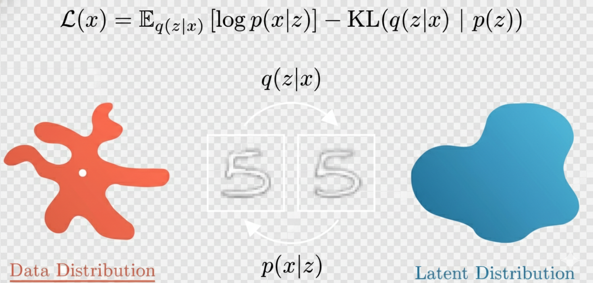

### AE结构
Encoder压缩到latent space 然后Decoder解码
### VAE相对AE的改进
不使用一个具体的向量来表示encoder后的embedding，而是使用一个概率分布p(z|x)来表示现实世界的分布p(x)，z就是这个向量可能的范围，我们近似的将其认为是一个高斯分布
### 具体实现
Encoder会把x映射为高斯分布的参数$\mu$ 和 $\sigma$
##### Loss

前面可以看成一个L2 loss，后面是KL散度
##### Reparameterization Trick
Decoder不可能从一个概率分布得到图像，需要首先从z中采样再计算，这就出现了问题：
- sample(z)是不可导的，无法反向传播
于是，使用Reparameterization Trick，z不再等于  $\mathcal{N}(\mu, \sigma)$，而是等于 $\mu + \sigma \cdot \epsilon$ ，其中 $\epsilon$ 属于 $\mathcal{N}(0, 1)$ 
##### 生成任务
想要生成4，只需要在latent space中4的向量fu'jing