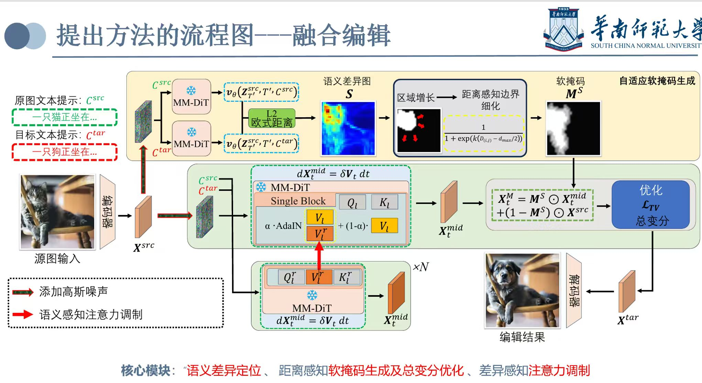
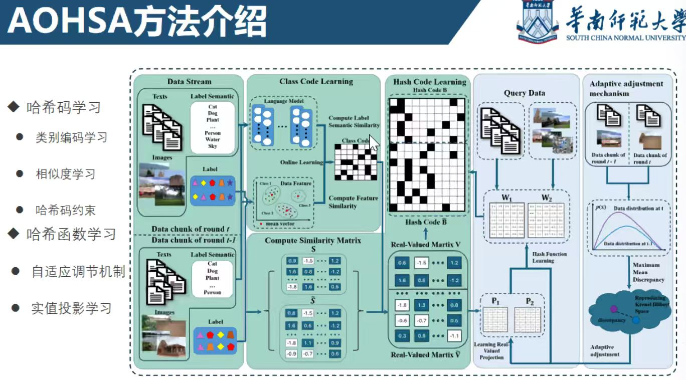

### 1号
#### 图像编辑
图像->带噪声->（注意力/掩码等方法）->编辑后的图像
使用速度场，类似flowmatching，定位错误区域（定位到DiT的某一个block）
##### 提问
1.单框架单流程的动机和目的？
- 主框架迁移方式可以按照pipeline，然后加模块
2.不需要额外参数达到sota？
- 还是需要的，表述错误，指的是不需要外部掩码
3.风格是怎么定义？
- 编辑之后保留风格，只改变内容，指的不是改变风格
4.定量如何衡量图片好坏？
- bre bench上测试，指标有掩码（指明哪里需要编辑），然后再掩码区域内计算距离，整张图像计算CLIP
5.怎么处理指标好但是人眼差的情况？
- 目前业界依然在用这种指标，可以引入VLM来判断
### 2号

#### 少样本多模态数据标注
音频+视频特征抽取，然后预融合，再喂给通用大模型
动态融合模块，动态置信度
##### 提问
1.给出实验表，改aigc
2.图改为中文，公式加标号，公式不能使用图片，综述没引用
3.面向的具体场景？
- 情绪分类领域
4.标注系统还是算法创新？
- 标注系统/pipeline
5.使用通用大模型？
- 是的，通过预融合使其适配特定领域
6.数据怎么喂给大模型？
- 特征+提示词模板
### 3号

#### 跨模态哈希检索
使得相同语义的在语义空间有相似的哈希值/哈希码
痛点：
1.哈希计算成本大
- 使用在线流水线的方法解决
2.概念偏移问题
- AOHSA：类编码形式的语义锚点
- 新的学习策略：对新旧类别量化损失
流程：
1. 学习一个不变的语言编码，作为锚点
2. 哈希码学习：生成一个指导码指导学习
3. 哈希函数学习：对新信息的关注不足，使用权重。
##### 提问
1.数据是无标签的多还是有标签的多
- 有监督的
2.具体场景
- 数据库里面内容计算哈希码，搜索引擎搜索内容哈希后，和数据库内异或，如果全0，就认为数据库和搜索内容很相近
### 4号
#### 跨模态哈希检索
动机：应对快速膨胀的数据
痛点：
1.成本高
2.静态环境
3.模态无配对但假设其配对
##### UIH方法
低秩投影重建+自适应语义边界+相似表示（特征融合，刻画不同模块之间的一致性）+哈希码学习
##### 实验
无配对+10%配对下达到SOTA
##### 提问
1.格式问题
2.指明输入输出
3.unpairdata是什么
- 多模态数据只有图片/文字，缺失了一个模态
### 5号
#### 动态视听问答
痛点：
1.token增加使得计算成本高->基于相似（聚类）的压缩方法
2.
##### 压缩模块
计算token距离，计算中位数，通过token数确定簇数
##### 提问
1.音频token压缩+视觉token压缩？
- 对
2.根据对应的KVcache是什么意思？
- 筛选之后丢掉一些不重要的token
3.第一个videollama，第二个qwen3，为什么？
- 选择比较新的模型
4.第二部分能继续使用videollama2？
- 可以
5.第一个工作是进行模态融合，和相似性压缩有什么关系？
- 工作的核心方法是基于相似性压缩，基于距离衡量相似与否，使用文本和图像相似性
### 6号
#### AI生成图像的通用检测器
目的：探照伪造图像
？？+频率空间解耦+QAD正交模块
单频率->双频率
架构：CLIP特征提取+MLP分类
CLIP特征分解后会进行奇异值分解
##### 提问
1.双模态+三模态？有两个视角模态算是三个模态吗？
2.数据生怎么生成？
- 一些是GAN生成，有些是diffusion
3.对比最新的能比较吗？
- 比小红书的好
4.旧数据集有效，新数据集不一定有效
- 需要限制以下检测的类型
5.二分类？
- 对的，输入图片，判断是否伪造
6.可以用大模型生成伪造数据，不一定要使用公开数据集
7.”通用“需要验证
### 7号
#### 基于大模型的多智能体协作
目前：生成动作时缺乏实时性；性能会随着时间下降，冗余的历史数据会影响LLM的判断；忽略推理时间；忽视了token的消耗；忽视了智能体之间的相互作用；
##### 异步通信
可以不需要等待，根据其他智能体的动作独自进行规划，能够减少使用时间，对话的token损耗下降
##### 无冲突动作
生成路径树，通过最短路径算法生成下一步动作
##### 强化记忆模块
减少信息丢失问题，GRPO训练，生成一个将以模型对生成的记忆进行打分；能够降低token消耗
##### 提问
1.目标是提升多智能体的效率？有没有具体明确对效率的定义和度量？多个维度都比过去的方法更好吗？复杂任务中减少对话会降低任务的成功率吗，如何平衡效率和性能？
- 推理的效率和对话的效率，计算对话次数和对话时间占总体时间的占比；以往的没有计算效率，无法比较；智能体可以选择等待，避免异步通信，提供灵活的方式来平衡性能和效率。
2.为什么选择overcooked这个任务？是否是一个足够典型的任务/场景？
- 分成很多个时间步来执行，以往的难以判断时间步多的场景
3.开题报告需要一个研究背景，直接写了大模型的研究现状，缺失了引出本文题目的内容（动机）。
4.要把具体的研究内容指出，而不是提出了一个怎么样的框架
5.题目是不是搞反了？对话里面的因素场景还是具身只能场景？题目有待商榷，题目过于宽泛？这个计划和具身智能有关系吗？题目太大，但是实验很具体/
6.做一个effient的事情，做了三个创新点，三个点之间有什么关联吗？需要一个整体的框架图来说明三个点之间的关系。
7.你对比的基线是什么？别人是怎么对比的？需要去参考别人是怎么对比的，确保你的工作是make sense的
### 8号
#### 多智能体策略优化
MCP提供了一种统一的工具调用格式，能够解决toolformer的痛点
##### 工具检索方法来进行工具选择
模型识别出需要外部工作来协作时，对结构化请求进行embeding，检索topK个最匹配的工具，然后将工具的结果返回给大模型整理，从海量的工具中筛选出有用的框架
##### MCP
查找iphone价格的例子
##### 框架
输出复杂任务查询->planing分解任务->对每个子任务进行平衡树的搜索->奖励评分的机制来获取最优的工具调用->记忆模块，记忆失败的轨迹，生成一个失败的总结，反馈给模型进行反思（返回0-1的分数）
##### 两个真实例子
查下周3北京到上海的高铁票
跳过了
##### 提问
1.好奇论文为什么叫”多智能体任务。。。“，感觉就是一个工具调用的改进，与题目不是很相关
- 可以在海量的工具中调用
2.推理和策略的优化，怎么反映在两个创新点上？
- 可以提升任务的准确性
3.题目非常大，内容非常宽，题目需要聚焦一下，需要明确场景，具体是工具调用还是工具链？
4.方案没有明确的技术路线，具体的思路是？目前的框架比较宽泛
- 查询可以针对动态的任务，可以解决时效性比较强的任务，任务搜索和推理的方法+记忆机制
5.描述层面还是偏理论，但是具体的方向还是没在开题报告上看到
6.开题报告一大块写完了，缺少了国内外的研究现状这一节
7.对比的方法是什么？和哪些方法做对比？
- mcp bench和api bench两个数据集

### 9号
#### 临床器官分割
轻量化的模型
特征提取双分支
##### 提问
1.优势是参数量和计算量比较少
2.学长的manba的因果比较一下

### 10号
输入图片/指令描述，输出符合指令的图片
